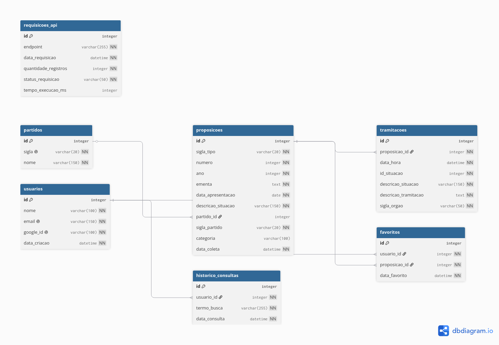

# Esquema do Banco de Dados — LegisKids

## Visão geral

O banco de dados do LegisKids é um PostgreSQL relacional composto por **7 tabelas** que suportam o ciclo completo da plataforma: coleta de proposições legislativas, classificação temática, acompanhamento de tramitações, autenticação de usuários, favoritos, histórico de buscas e auditoria de chamadas à API da Câmara dos Deputados.

A fonte de verdade do schema são os modelos SQLAlchemy em `src/backend/models.py`. As migrations em `migrations/versions/` garantem que o banco físico reflita esses modelos — sempre rode `python -m flask --app src/backend/app.py db upgrade` ao puxar mudanças.

---

## Diagrama Entidade-Relacionamento



> O código-fonte do diagrama está em [`docs/db/erd.dbml`](./erd.dbml) e pode ser editado no [dbdiagram.io](https://dbdiagram.io).

---

## Tabelas

### partidos

Armazena os partidos políticos usados para classificar as proposições. Os IDs são os identificadores oficiais da API da Câmara dos Deputados e são pré-populados pelo script `scripts/seed.py`.

| Coluna | Tipo | Obrigatória | Descrição |
|---|---|---|---|
| `id` | integer | Sim | ID oficial do partido na API da Câmara dos Deputados (PK) |
| `sigla` | varchar(20) | Sim | Sigla do partido (ex: PT, PL, MDB) — única no banco |
| `nome` | varchar(150) | Sim | Nome completo do partido |

**Constraints:** `id` PK · `sigla` UNIQUE

---

### proposicoes

Tabela central do sistema. Armazena as proposições legislativas coletadas da API da Câmara dos Deputados. Cada proposição é identificada de forma única pela combinação de tipo, número e ano.

| Coluna | Tipo | Obrigatória | Descrição |
|---|---|---|---|
| `id` | integer | Sim | ID oficial da proposição na API da Câmara (PK) |
| `sigla_tipo` | varchar(20) | Sim | Tipo da proposição (ex: PL, PEC, MPV, PDC) |
| `numero` | integer | Sim | Número da proposição no ano |
| `ano` | integer | Sim | Ano de apresentação da proposição |
| `ementa` | text | Sim | Texto da ementa conforme registro oficial |
| `data_apresentacao` | date | Sim | Data em que a proposição foi apresentada à Câmara |
| `descricao_situacao` | varchar(150) | Sim | Situação atual da proposição (ex: "Aguardando Pauta") |
| `partido_id` | integer | Não | FK para `partidos.id` — nulo se partido não identificado na coleta |
| `sigla_partido` | varchar(20) | Sim | Cópia desnormalizada da sigla do partido para leitura rápida |
| `categoria` | varchar(100) | Não | Classificação temática derivada por palavras-chave ou IA (campo derivado) |
| `data_coleta` | datetime | Sim | Timestamp automático do momento em que a proposição foi coletada |

**Constraints:** `id` PK · `(sigla_tipo, numero, ano)` UNIQUE · `partido_id` FK → `partidos.id` ON DELETE SET NULL

---

### tramitacoes

Registra o histórico de tramitação de cada proposição. Cada linha representa uma etapa do processo legislativo de uma proposição específica, na ordem em que ocorreu.

| Coluna | Tipo | Obrigatória | Descrição |
|---|---|---|---|
| `id` | integer | Sim | Identificador único da tramitação (PK) |
| `proposicao_id` | integer | Sim | FK para `proposicoes.id` — identifica a proposição à qual pertence |
| `data_hora` | datetime | Sim | Data e hora do evento de tramitação |
| `id_situacao` | integer | Sim | Código numérico da situação conforme API da Câmara |
| `descricao_situacao` | varchar(150) | Sim | Descrição textual da situação (ex: "Aprovado") |
| `descricao_tramitacao` | text | Sim | Texto completo da movimentação registrada |
| `sigla_orgao` | varchar(50) | Sim | Sigla do órgão responsável (ex: PLEN, CCJ, CFT) |

**Constraints:** `id` PK · `proposicao_id` FK → `proposicoes.id` ON DELETE CASCADE

---

### usuarios

Armazena os usuários autenticados via Google OAuth 2.0. Não há senha armazenada — a autenticação é delegada integralmente ao Google.

| Coluna | Tipo | Obrigatória | Descrição |
|---|---|---|---|
| `id` | integer | Sim | Identificador interno do usuário (PK) |
| `nome` | varchar(100) | Sim | Nome completo conforme conta Google |
| `email` | varchar(150) | Sim | Endereço de e-mail do usuário — único no banco |
| `google_id` | varchar(100) | Sim | ID único do usuário na plataforma Google — único no banco |
| `data_criacao` | datetime | Sim | Timestamp automático do primeiro login |

**Constraints:** `id` PK · `email` UNIQUE · `google_id` UNIQUE

---

### favoritos

Tabela associativa que relaciona usuários às proposições que eles salvaram como favoritas. A constraint única composta impede que um usuário favorite a mesma proposição mais de uma vez.

| Coluna | Tipo | Obrigatória | Descrição |
|---|---|---|---|
| `id` | integer | Sim | Identificador do registro de favorito (PK) |
| `usuario_id` | integer | Sim | FK para `usuarios.id` — usuário que favoritou |
| `proposicao_id` | integer | Sim | FK para `proposicoes.id` — proposição favoritada |
| `data_favorito` | datetime | Sim | Timestamp automático do momento em que foi salvo |

**Constraints:** `id` PK · `(usuario_id, proposicao_id)` UNIQUE · `usuario_id` FK → `usuarios.id` ON DELETE CASCADE · `proposicao_id` FK → `proposicoes.id` ON DELETE CASCADE

---

### historico_consultas

Registra o histórico de buscas realizadas por usuários autenticados. Permite exibir as últimas buscas do usuário e futuramente analisar padrões de uso.

| Coluna | Tipo | Obrigatória | Descrição |
|---|---|---|---|
| `id` | integer | Sim | Identificador do registro de histórico (PK) |
| `usuario_id` | integer | Sim | FK para `usuarios.id` — usuário que realizou a busca |
| `termo_busca` | varchar(255) | Sim | Texto exato digitado na busca |
| `data_consulta` | datetime | Sim | Timestamp automático do momento da busca |

**Constraints:** `id` PK · `usuario_id` FK → `usuarios.id` ON DELETE CASCADE

---

### requisicoes_api

Log de auditoria das chamadas realizadas à API da Câmara dos Deputados. Permite rastrear o volume de coletas, identificar falhas recorrentes e monitorar o tempo de resposta ao longo do tempo.

| Coluna | Tipo | Obrigatória | Descrição |
|---|---|---|---|
| `id` | integer | Sim | Identificador do registro de requisição (PK) |
| `endpoint` | varchar(255) | Sim | URL ou identificador do endpoint consultado na API da Câmara |
| `data_requisicao` | datetime | Sim | Timestamp automático da requisição |
| `quantidade_registros` | integer | Sim | Número de registros retornados pela chamada |
| `status_requisicao` | varchar(50) | Sim | Status do resultado (ex: `sucesso`, `erro_504`, `timeout`) |
| `tempo_execucao_ms` | integer | Não | Duração da chamada em milissegundos — campo de monitoramento opcional |

**Constraints:** `id` PK

---

## Relacionamentos

```
partidos ──────────────────── proposicoes          (1 para N)
proposicoes ──────────────── tramitacoes           (1 para N)
proposicoes ──────────────── favoritos             (1 para N)
usuarios ─────────────────── favoritos             (1 para N)
usuarios ─────────────────── historico_consultas   (1 para N)
```

**partidos → proposicoes (1:N)**
Um partido pode estar associado a muitas proposições. Uma proposição pertence a no máximo um partido. A FK `partido_id` é nullable — caso o partido não seja identificado na coleta, o campo fica nulo e `sigla_partido` preserva a sigla textual.

**proposicoes → tramitacoes (1:N)**
Uma proposição pode ter muitas tramitações ao longo de seu ciclo legislativo. Cada tramitação pertence a exatamente uma proposição. O `ON DELETE CASCADE` garante que ao apagar uma proposição todas as suas tramitações são removidas automaticamente.

**proposicoes → favoritos (1:N) / usuarios → favoritos (1:N)**
A tabela `favoritos` representa o relacionamento entre usuários e proposições. Um usuário pode favoritar muitas proposições; uma proposição pode ser favoritada por muitos usuários. A constraint `UNIQUE (usuario_id, proposicao_id)` impede duplicatas por par usuário-proposição.

**usuarios → historico_consultas (1:N)**
Um usuário pode ter muitos registros de busca. O `ON DELETE CASCADE` garante conformidade com requisitos de exclusão de dados (LGPD) — ao remover um usuário, todo o histórico é apagado.

---

## Índices e constraints importantes

| Tabela | Constraint | Tipo | Comportamento |
|---|---|---|---|
| `partidos` | `id` | PK | — |
| `partidos` | `sigla` | UNIQUE | Impede dois partidos com a mesma sigla |
| `proposicoes` | `id` | PK | — |
| `proposicoes` | `(sigla_tipo, numero, ano)` | UNIQUE | Impede duplicatas da mesma proposição em coletas repetidas |
| `proposicoes` | `partido_id → partidos.id` | FK | ON DELETE SET NULL — proposição permanece sem partido |
| `tramitacoes` | `id` | PK | — |
| `tramitacoes` | `proposicao_id → proposicoes.id` | FK | ON DELETE CASCADE — tramitações removidas junto com a proposição |
| `usuarios` | `id` | PK | — |
| `usuarios` | `email` | UNIQUE | Um e-mail por conta |
| `usuarios` | `google_id` | UNIQUE | Um Google ID por conta |
| `favoritos` | `id` | PK | — |
| `favoritos` | `(usuario_id, proposicao_id)` | UNIQUE | Impede favorito duplicado |
| `favoritos` | `usuario_id → usuarios.id` | FK | ON DELETE CASCADE |
| `favoritos` | `proposicao_id → proposicoes.id` | FK | ON DELETE CASCADE |
| `historico_consultas` | `id` | PK | — |
| `historico_consultas` | `usuario_id → usuarios.id` | FK | ON DELETE CASCADE |
| `requisicoes_api` | `id` | PK | — |

---

## Decisões de design

**`partido_id` nullable em `proposicoes`**
A API da Câmara nem sempre retorna o partido do autor de uma proposição de forma estruturada. Para não bloquear a coleta, o campo `partido_id` é opcional. O campo `sigla_partido` (não-nullable) preserva sempre a sigla textual retornada pela API, mesmo quando a FK não pode ser resolvida. Isso é intencional: `sigla_partido` é uma cópia desnormalizada para leitura rápida e proteção contra perda de informação.

**`categoria` como campo derivado**
A coluna `categoria` em `proposicoes` não é preenchida pelo usuário nem pela API — ela é derivada por filtragem de palavras-chave ou pelo módulo de IA. Por isso é nullable: proposições recém-coletadas entram no banco sem categoria e são classificadas posteriormente (processamento assíncrono).

**Unique composta em `favoritos`**
A tabela `favoritos` usa `UNIQUE (usuario_id, proposicao_id)` em vez de confiar na lógica da aplicação para evitar duplicatas. Isso garante integridade no banco independentemente de qualquer bug de camada de serviço.

**`ON DELETE CASCADE` em tramitacoes, favoritos e historico_consultas**
Entidades dependentes são tratadas como filhas sem sentido de existência independente. Se uma proposição é apagada, suas tramitações e favoritos associados perdem o contexto; se um usuário é removido, favoritos e histórico seguem a LGPD e são apagados. O `CASCADE` delega ao banco essa responsabilidade, evitando dados órfãos.

**`ON DELETE SET NULL` em proposicoes.partido_id**
Se um partido for apagado do banco (cenário raro), as proposições associadas não devem ser apagadas — apenas `partido_id` vai a nulo e `sigla_partido` preserva o registro histórico.

**`requisicoes_api` como log de auditoria**
Esta tabela não está relacionada a nenhuma outra — é um log independente. O objetivo é rastrear o comportamento do coletor ao longo do tempo: frequência de chamadas, endpoints mais usados, taxas de erro e tempo de resposta. Não tem FK porque um registro de requisição deve persistir mesmo que os dados coletados sejam apagados.

**`tempo_execucao_ms` nullable em `requisicoes_api`**
Monitoramento de tempo de execução é instrumentação opcional. Em cenários onde a medição não é possível ou relevante (ex: requisições assíncronas sem callback), o campo pode ser omitido sem invalidar o registro de auditoria.

---

## Como manter este documento atualizado

Sempre que uma nova migration for criada (`flask db migrate`):

1. Editar `docs/db/erd.dbml` refletindo as mudanças nos modelos
2. Reimportar o `.dbml` no [dbdiagram.io](https://dbdiagram.io) e exportar um novo `erd.png`
3. Atualizar as tabelas e seções relevantes neste `schema.md`
4. Commitar os três arquivos juntos com a migration
